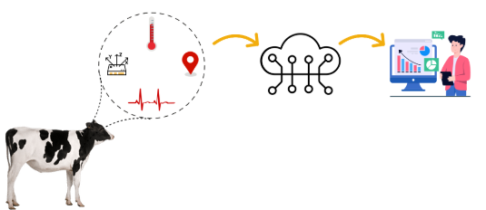
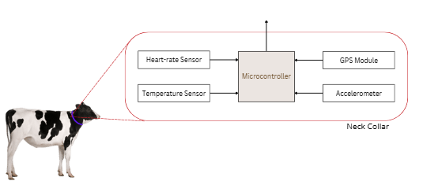
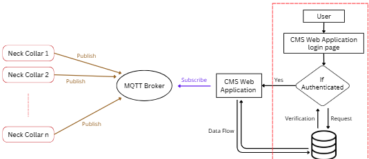

# Cattle Management System  

## Introduction  
The Cattle Management System is a proposed solution designed to enhance the management and monitoring of cattle. The system focuses on two main features: **health monitoring** and **location tracking**. The system aims to improve livestock management by providing farmers with real-time data, enabling them to make informed decisions and ensure the safety and health of their cattle. This project is designed to be user-friendly, making it easy for farmers to manage their cattle efficiently.  

## Health Monitoring Feature  
The health monitoring feature allows farmers to track the well-being of each animal by recording important health data such as **temperature** and **heart rate**. By continuously monitoring these data points, the system helps identify any health abnormalities early, allowing farmers to intervene and prevent further issues.  

## Location Tracking Feature  
The location tracking feature helps monitor the movement of cattle within a designated area, ensuring that they are where they are supposed to be and preventing issues like wandering or theft. This feature utilizes technologies such as **GPS module** to provide real-time updates on the cattle's location, ensuring their safety.  

## Impact on Livestock Management  
Our system gives a solution to overcome the errors in traditional health monitoring and improve operational efficiency, enhances livestock management and ensures better productivity and animal welfare.  

## High Level System Organization

The above diagram shows a high-level architecture of how the system is organized. The wearable neck collar collects heart rate, temperature, and location data and sends it to the backend cloud server through an MQTT broker.

### 1. Neck Collar(IoT Device)

The neck collar is a combination of a microcontroller and other sensors. The sensors send data to the MQTT broker via the ESP32 microcontroller.

### 2. Data Flow in the System

The above diagram shows the flow of data in our system. Multiple neck collars establish a connection with the MQTT broker and publish data to it. The server subscribes and listens to the topics in the MQTT broker. 

The data flow of user login and authentication is shown in red.

### 3. Control Flow
 

  
  

The above diagram shows the control flow in our system. The data sent to the backend is processed and passed through some predefined control statements. If the conditions are not satisfied the user (farm management) is alert about that specific cattle. also, the specific cattle is continuously monitored in opposition to timely monitoring.  

